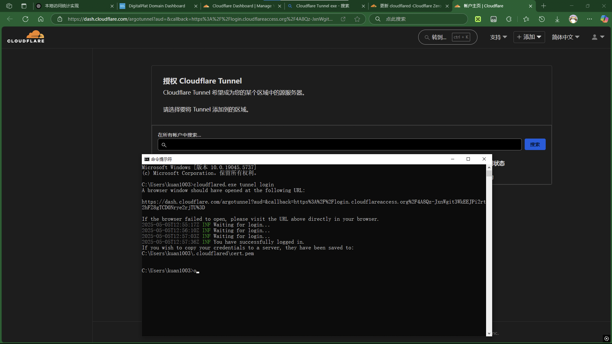

## Cloudflare Tunnel实现内网穿透
让外部用户访问我的域名时，其实访问的是我本地电脑的服务，并且我能看到他们的IP和访问次数
大致流程是↓
外部访问者
    ↓ 访问我的域名
Cloudflare网络
    ↓ 把请求通过隧道转发
Cloudflare Tunnel(cloudflared)
    ↓
我的本地Flask服务（http://localhost:5000）
    ↓
程序输出IP和访问次数
## 1安装Flask
cmd
```bash
pip install flask
```
## 2下载server.py
## 3登录CloudflareTunnel
[Cloudflare下载exe]https://developers.cloudflare.com/cloudflare-one/connections/connect-networks/downloads/
或运行
cmd
```bash
winget install --id Cloudflare.cloudflared
```
然后
cmd
```bash
cloudflared.exe tunnel login
```
会打开浏览器让你登录cloudflare(前提是你的cloudflare已经托管你的域名了)
登录完成后会在"C:\Users\用户名\.cloudflared\xxx.json"这个路径出现json文件

## 4创建和配置隧道
创建（取名随意 比如kuan-tunnel）
cmd
```bash
cloudflared.exe tunnel create kuan-tunnel
```
绑定玉米
cmd
```bash
cloudflared.exe tunnel route dns kuan-tunnel 你的域名
```
把项目的yml放在C:\Users\你的用户名\.cloudflared\config.yml这个目录下
## 最后
先运行server.py再在cmd输入
```bash
cloudflared.exe tunnel run kuan-tunnel
```
## 测试访问你的域名不出意外会返回IP1.2.3.4  访问次数:1
